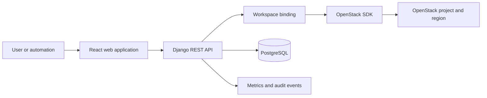

# Architecture

## Overview

OrcaCloud separates its application control plane from its infrastructure control plane. The application receives authenticated requests, resolves the caller's workspace binding, opens a scoped OpenStack connection, performs the requested operation, and records an audit entry.



## Workspace Isolation

The workspace binding is the central tenant-isolation boundary.

| Object | Role |
| --- | --- |
| `Workspace` | Team or project container identified by `workspace_id` |
| `WorkspaceBinding` | Maps a workspace and environment to an OpenStack project, region, and quotas |
| `ProvisionedResource` | Audit record for resources created through the platform |

New provisioning code must resolve the binding and use its connection. A direct global OpenStack connection is only appropriate for local development or explicitly legacy code.

```python
binding = WorkspaceService.resolve(workspace_id, environment)
connection = WorkspaceService.get_connection(binding)
```

## Major Components

| Layer | Components | Purpose |
| --- | --- | --- |
| Experience | React webapp and dashboard applications | User and operator interfaces |
| Application | Django `cloudapi`, REST endpoints, service modules | Authentication, orchestration, policy, API responses |
| Data and messaging | PostgreSQL, Redis, RabbitMQ, Kafka, ZooKeeper | Persistence, cache, asynchronous messaging, coordination |
| Cloud services | Keystone, Nova, Neutron, Cinder, Glance, Octavia | Identity, compute, network, storage, images, load balancing |
| Delivery and operations | GitHub Actions, GHCR, Docker Compose, Terraform, Ansible | Application delivery and infrastructure lifecycle |
| Observability | Prometheus, Grafana, Alertmanager | Metrics, dashboards, and alerting |

## Regional Cloud Model

The cloud enablement model uses three logical OpenStack regions:

| Region | Cloud model | Intent |
| --- | --- | --- |
| `RegionA` | Public | Shared multi-tenant services |
| `RegionB` | Private | Dedicated enterprise projects and network isolation |
| `RegionC` | Hybrid | Customer datacenter connectivity and cross-domain integration |

Profiles are documented in `cloudapi/clouds.yaml.example`. Never commit actual OpenStack credentials to a repository.

## Related Pages

- [[Getting Started]]
- [[Security]]
- [[Repository Guide]]
- [Detailed architecture guide](https://github.com/Orcastack/orcacloud/blob/main/ARCHITECTURE.md)
