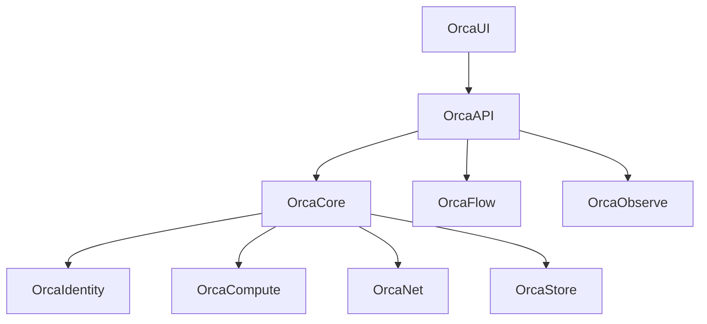

# Modules and Components

OrcaCloud uses repository-aligned components rather than a single monolith. The labels below describe the platform roles; they do not imply separate products or binaries.

| Platform role | Repository areas | Purpose | Inputs and outputs |
| --- | --- | --- | --- |
| OrcaAPI | `cloudapi/`, backend service modules | REST API, authentication, policy, orchestration | Authenticated requests in; normalized resource and status responses out |
| OrcaUI | `webapp/`, `cloudapp/`, `enterpriseapp/`, and dashboard apps | Developer and operator interfaces | API responses in; user actions and views out |
| OrcaCore | `cloudapi/services/`, workspace service code | Workspace resolution, tenant policy, resource audit registration | Workspace context in; scoped provider operation context out |
| OrcaCompute | `openstack/compute/`, infrastructure compute modules | Nova, containers, bare metal, accelerator, and Kubernetes integration | Workload request in; provider resource state out |
| OrcaNet | `networking/`, `openstack/networking/` | Tenant networks, routers, security groups, load balancing, DNS | Network intent in; allocated network resources out |
| OrcaStore | `openstack/storage/`, storage automation | Volumes, snapshots, images, objects, and shares | Storage request in; capacity and resource references out |
| OrcaIdentity | `identity/`, Keystone and RBAC modules | Authentication, roles, projects, secret-management integration | Identity context in; scoped authorization out |
| OrcaFlow | `workflows/`, `serverless/`, `gitops/` | Workflow execution, event automation, GitOps, and serverless resources | Events and definitions in; automated execution out |
| OrcaObserve | `monitoring/`, observability configuration | Metrics, dashboards, alerts, logs, and traces | Telemetry in; dashboards and alerts out |

## Module Boundary Rules

1. API endpoint code resolves a workspace binding before provider calls.
2. Provider modules receive a scoped connection rather than choosing a global tenant.
3. UI code calls the API layer; it does not embed infrastructure credentials.
4. Infrastructure changes belong in Terraform, Ansible, Kubernetes, Helm, or GitOps definitions instead of ad hoc runtime edits.
5. Secrets belong in the relevant secret-management system or deployment environment, never in source files.

## Dependencies

See [[Development Guide]] for the source tree and contribution boundaries.
