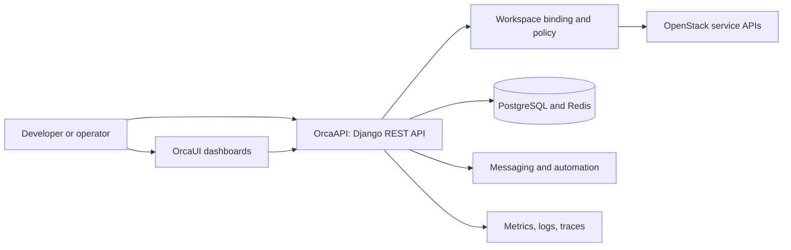
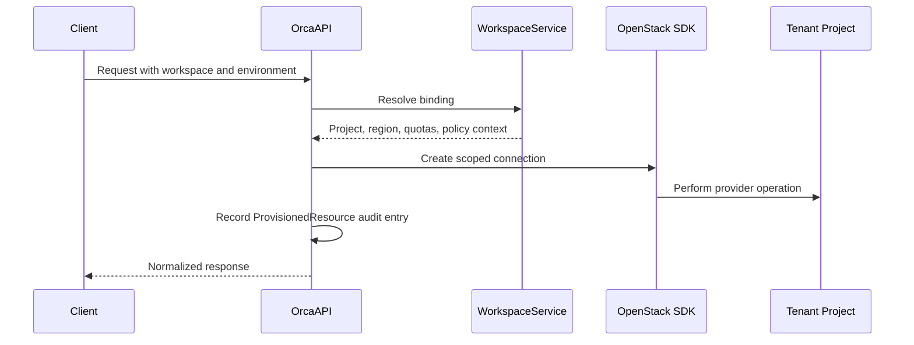

# System Architecture

## Platform Context

OrcaCloud sits between developers and infrastructure providers. It exposes application-level APIs and dashboards while routing infrastructure requests through workspace-scoped OpenStack connections.

## C4 Level 1: System Context

| External system | Integration purpose |
| --- | --- |
| OpenStack | Compute, network, storage, image, identity, and orchestration services |
| Identity providers | Keystone federation and enterprise identity integration paths |
| GitHub | Source control, CI/CD, image registry, and Wiki publishing |
| Observability services | Prometheus metrics, Grafana dashboards, and alert delivery |

## C4 Level 2: Containers

| Container | Responsibility |
| --- | --- |
| React applications | Developer, cloud, enterprise, account, and operations interfaces |
| Django API | Authentication, orchestration, policy enforcement, and normalized responses |
| PostgreSQL | Application and audit persistence |
| Redis | Cache and application coordination |
| RabbitMQ, Kafka, ZooKeeper | Messaging, event streams, and coordination integration |
| OpenStack integrations | Provider-specific operations behind the workspace boundary |

## Control and Worker Planes

**Control plane:** Django service modules, workspace bindings, identity, policy, GitOps, and infrastructure definitions decide what should happen and who may request it.

**Worker plane:** OpenStack compute and storage services, Kubernetes workloads, serverless functions, and automation engines execute the requested work.

## Tenant and Region Boundary

Each workspace binding maps a workspace plus environment to a specific OpenStack project, region, and quota set. This is the principal multi-tenant isolation mechanism.

## Network, Storage, and Observability

- **Networking:** Neutron and OVN provide tenant networks, routers, floating IPs, security groups, and load-balancing integration.
- **Storage:** Cinder, Ceph-oriented infrastructure, Glance, Swift, and Manila integrations support block, image, object, and shared storage patterns.
- **Observability:** Prometheus, Grafana, Alertmanager, logging, and tracing assets are version controlled under `monitoring/` and related directories.

See [[Modules and Components]] and [[System Workflows]] for implementation-level detail.
