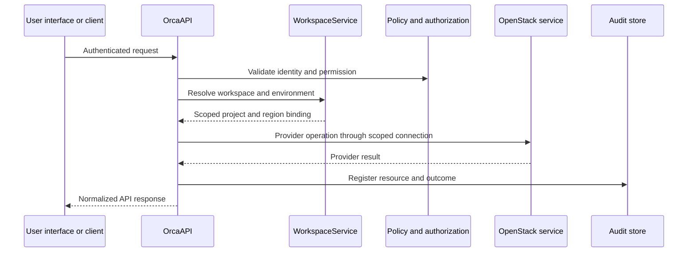
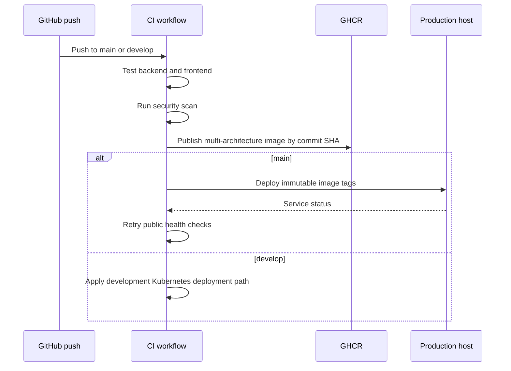

# System Workflows

## API Request Lifecycle

## Application Delivery Workflow

## Scaling Workflow

1. Observability detects capacity pressure or a tenant quota threshold.
2. An operator classifies the constraint as compute, storage, network pool, or quota.
3. The appropriate infrastructure automation or OpenStack change is prepared and reviewed.
4. Capacity is added or rebalanced.
5. Operators verify service registration, resource health, and post-change telemetry.

For Ceph changes, completion requires placement groups to return to `active+clean`.

## Network and Storage Provisioning

Network provisioning uses the workspace's OpenStack project to create or retrieve the tenant network, subnet, router, security group, floating IP, load balancer, or DNS resource. Storage provisioning follows the same binding pattern for volumes, snapshots, images, objects, or shares.

The principle is unchanged across workflows: resolve the workspace first, then call the provider through that scoped context.