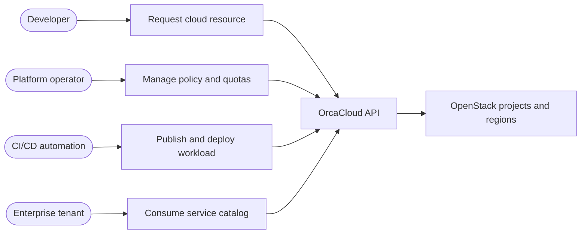

# Use Cases

## Platform Use Cases

| Use case | Outcome | Relevant components |
| --- | --- | --- |
| Deploying microservices | Teams deploy application services with consistent API and environment controls | OrcaAPI, OrcaUI, Kubernetes, GitOps |
| Managing distributed workloads | Operators coordinate compute, messaging, storage, and automation dependencies | OrcaCompute, OrcaFlow, OrcaStore |
| Multi-tenant isolation | Each workspace routes to the intended project, region, quota, and policy context | OrcaCore, OrcaIdentity |
| Network policy enforcement | Teams define tenant network boundaries, security groups, and ingress behavior | OrcaNet, OVN, Neutron, Kubernetes policies |
| Infrastructure automation | Repeatable infrastructure changes are represented as Terraform and Ansible assets | Terraform, Ansible, GitHub Actions |
| Automated scaling | Capacity teams respond to demand signals through documented compute, storage, quota, and IP-pool procedures | OrcaObserve, operations runbooks |
| CI/CD integration | Changes are tested, scanned, built, tagged, and deployed through GitHub workflows | CI/CD workflows, GHCR |
| Public, private, and hybrid cloud | Workspace bindings select region and tenancy model for each customer environment | Workspace bindings, OpenStack regions |

## Example: Enterprise Tenant Provisioning

An enterprise operator creates a workspace, binds it to a private or hybrid OpenStack project, assigns roles, applies quotas, and then exposes only the service catalog that matches the tenant's entitlements. Each later infrastructure request carries the workspace context through the API to the provider project.

## Non-Goals

OrcaCloud is not intended to bypass provider-level controls, embed cloud credentials in user interfaces, or replace all infrastructure automation with manual console operations.

Continue with [[System Workflows]] to see how these use cases move through the platform.